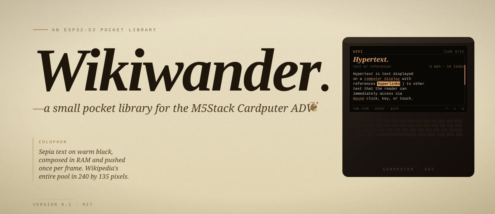
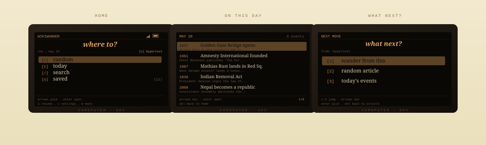

<div align="center">



<br><br>

<sub>
<kbd>r</kbd> random &nbsp;·&nbsp;
<kbd>t</kbd> today &nbsp;·&nbsp;
<kbd>/</kbd> search &nbsp;·&nbsp;
<kbd>s</kbd> saved &nbsp;·&nbsp;
<kbd>Tab</kbd> link &nbsp;·&nbsp;
<kbd>q</kbd> qr &nbsp;·&nbsp;
<kbd>u</kbd> resume &nbsp;·&nbsp;
<kbd>c</kbd> settings
</sub>

<br><br>

</div>

> *Wikipedia is a graph of six million articles knotted together by tens of millions of links. Wikiwander walks it. Press a key on a tiny pocket device, end up somewhere you&#39;d never have searched for.*

<br>

## A walk you wouldn&#39;t have planned


<br>

Every article has links. Tap any one, that article has more. Five clicks in, you&#39;ve crossed disciplines you would never have searched for in the same session. Wikiwander doesn&#39;t fight that — it&#39;s built around it. Random opens a door at random. Tab cycles through every link in the current page. `enter` walks. `b` walks back. The trail caps at twelve so a long session doesn&#39;t fragment the heap.

<br>

## The screens



<br>

## What it does

<table>
<tr>
<td width="50%" valign="top">

#### <kbd>r</kbd>&nbsp;&nbsp;Random
Curated summary from Wikipedia's random pool. Built-in filter quietly re-rolls past biographies — the encyclopedia is &thinsp;30% people if you let it be.

#### <kbd>t</kbd>&nbsp;&nbsp;Today
What happened on this date. Scrollable curated events, each with a year and a primary article you can open.

#### <kbd>/</kbd>&nbsp;&nbsp;Search
Live MediaWiki opensearch. <kbd>Tab</kbd> to focus the result list, arrows or <kbd>1</kbd>–<kbd>9</kbd> to pick.

#### <kbd>Tab</kbd>&nbsp;&nbsp;Inline links
Lead-section HTML is fetched separately, tokenized into text and link runs, rendered with per-segment color. Tab cycles each link in turn; <kbd>↩</kbd> follows.

#### <kbd>b</kbd>&nbsp;&nbsp;Walk trail
Every forward jump pushes onto an in-memory breadcrumb. Step back through your walk one article at a time.

</td>
<td width="50%" valign="top">

#### <kbd>s</kbd>&nbsp;&nbsp;Library
Articles save to `/Wikiwander/articles/` as markdown with YAML frontmatter. An HTML sidecar preserves the links so saved articles stay tappable.

#### <kbd>q</kbd>&nbsp;&nbsp;QR share
Generate a code of the canonical Wikipedia URL. Scan with a phone to continue on a bigger screen.

#### <kbd>u</kbd>&nbsp;&nbsp;Resume
The device remembers your last article. Battery dies mid-walk, you power on, press <kbd>u</kbd>, you&apos;re right where you left off.

#### <kbd>c</kbd>&nbsp;&nbsp;Settings
Text size in three steps (small / medium / large — Font2 bitmap or FreeSans 9 / 12 pt vector), people filter, audio mute.

#### <kbd>m</kbd>&nbsp;&nbsp;Audio
Subtle ES8311 speaker blips for save / reroll / back / error / nav. Mute toggleable; preference persists in NVS.

</td>
</tr>
</table>

<br>

## Install

> Wikiwander runs as a guest app under [bmorcelli&apos;s&nbsp;Launcher](https://github.com/bmorcelli/Launcher), so the install is two files on an SD card and one menu pick.

<table>
<tr><td><b>01</b></td><td>Flash bmorcelli&apos;s Launcher to your Cardputer ADV using the web flasher. One-time, ~30 seconds.</td></tr>
<tr><td><b>02</b></td><td>Drop <code>Wikiwander.bin</code> into <code>/apps/</code> on the SD card.</td></tr>
<tr><td><b>03</b></td><td>Create <code>/Cardputer/wifi.txt</code> on the SD root — one SSID per line followed by its password, blank lines separating networks.</td></tr>
<tr><td><b>04</b></td><td>Boot the launcher → SD → install Wikiwander.bin. Done.</td></tr>
</table>

```text
HomeNetwork
my-home-password

OfficeWiFi
my-office-password
```

Wikiwander scans nearby networks at boot and only attempts SSIDs actually in range — multi-location creds are fine, they don&apos;t slow each other down.

<br>

## Build from source

```bash
git clone git@github.com:CHARL3X/WikiWander---CardputerADV.git
cd WikiWander---CardputerADV
pio run -e cardputer     # builds dist/Wikiwander.bin (~1.2 MB)
```

Uses the stock `espressif32@6.12.0` platform. No pioarduino fork needed.

For the parser + transport tests on host (no device required), there&apos;s a separate MSVC-based loop:

```cmd
test\run_native.bat      :: 75+ unit tests, ~2 seconds
test\run_walker.bat      :: live walker against Wikipedia, ~5 seconds
```

<br>

## Underneath

<table>
<tr>
<th align="left" width="50%">Hardware</th>
<th align="left" width="50%">Stack</th>
</tr>
<tr>
<td valign="top">

| | |
|---|---|
| SoC | ESP32-S3 |
| Flash | 8 MB · single factory partition |
| RAM used | ~50 KB / 320 KB |
| Display | 240 × 135 ST7789, unbuffered |
| Storage | microSD via FSPI |

</td>
<td valign="top">

| | |
|---|---|
| Platform | espressif32 @ 6.12.0 |
| Framework | arduino-esp32 |
| JSON | ArduinoJson 7 (filtered stream) |
| Network | WiFiClientSecure + chunked decoder |
| Tests | 75+ native against fixtures |

</td>
</tr>
</table>

<details>
<summary><b>Wikipedia endpoints in play</b></summary>

| Used for | Endpoint |
|---|---|
| Random | `/api/rest_v1/page/random/summary` |
| By title | `/api/rest_v1/page/summary/{title}` |
| Lead HTML (for inline links) | `/w/api.php?action=parse&section=0&prop=text` |
| Morelike search | `/w/api.php?action=query&list=search&srsearch=morelike:{title}` |
| OpenSearch | `/w/api.php?action=opensearch&search={q}` |
| On This Day | `/api/rest_v1/feed/onthisday/selected/MM/DD` |

</details>

<details>
<summary><b>Screen layout (240 × 135)</b></summary>

| Region | Height | Notes |
|---|---|---|
| Status bar | 14 px | Left label + right context |
| Body | 101 px | Variable lines depending on font choice |
| Hint bar | 20 px | Two rows of Font0 |
| Render cadence | 25 fps | Single `pushSprite()` per frame, no flicker |

</details>

<details>
<summary><b>Source layout</b></summary>

```
lib/wiki/                 Pure C++, no Arduino/M5 dependencies
├── wiki_types.h          ArticleSummary, RelatedItem, SearchHit, TodayEvent
├── wiki_parser.{h,cpp}   JSON → structs (ArduinoJson 7 + filter)
├── extract_html.{h,cpp}  HTML tokenizer for inline links
├── transport.h           ByteReader + Transport interface
└── wiki_client.{h,cpp}   URL construction + parser glue

src/net/transport_device.cpp
                          WiFiClientSecure transport with chunked +
                          streamed body readers

src/storage/
├── settings.{h,cpp}      NVS-backed prefs (namespace: wikiwander)
├── sd_config.{h,cpp}     SD mount + wifi.txt loading
└── wiki_store.{h,cpp}    Save/load articles (.md + .html sidecar)

src/ui/
├── colors.h              Sepia palette + layout constants
├── boot_ui.{h,cpp}       Static-screen helpers
├── splash.{h,cpp}        Boot animation
├── sound.{h,cpp}         Audio feedback
├── indicators.{h,cpp}    Battery + WiFi icons
├── text_utils.{h,cpp}    Word-wrap, ASCII sanitize, ellipsize
└── wiki_screen.{h,cpp}   Screen state machine
```

</details>

<br>

## Credits

[Wikipedia](https://www.mediawiki.org/wiki/API:REST_API) does all the actual work.
[ArduinoJson](https://arduinojson.org/) streams the JSON.
[M5Stack](https://m5stack.com/) makes the hardware.
[bmorcelli&apos;s Launcher](https://github.com/bmorcelli/Launcher) hosts the install.

<br>

<div align="center">
<sub><i>Wikiwander v0.1 · MIT License · built by <a href="https://github.com/CHARL3X">CHARL3X</a></i></sub>
</div>
